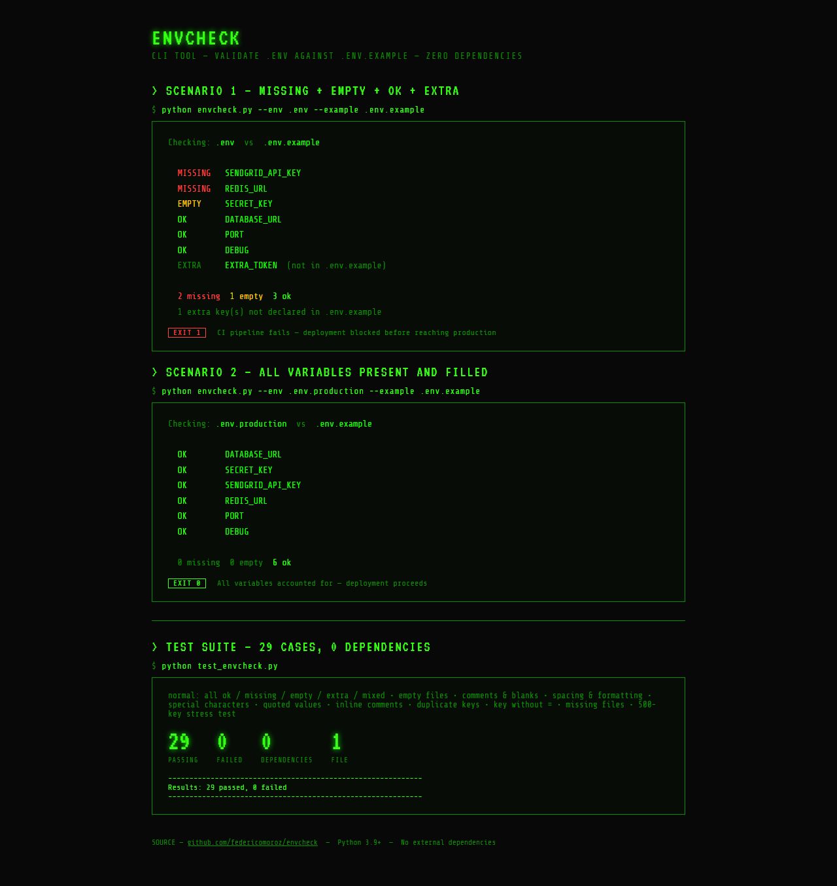
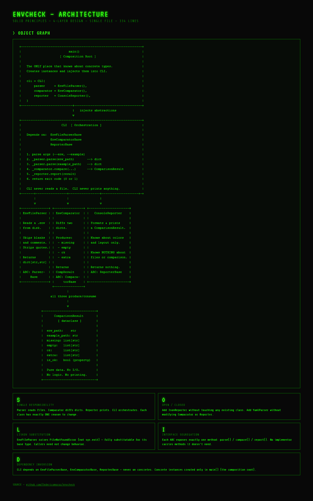

# envcheck

A zero-dependency CLI tool that validates your `.env` file against `.env.example` — catches missing, empty, and undeclared variables before they cause runtime errors.

---



---

## The problem

Every project has a `.env.example` that declares which variables are required. In practice, developers forget to add new variables to their local `.env`, or leave them empty. These omissions only surface at runtime — often in production.

`envcheck` catches them in one command.

---

## Usage

```bash
python envcheck.py
```

Default behavior: compares `.env` against `.env.example` in the current directory.

```bash
python envcheck.py --env .env.staging --example .env.example
```

**Output:**

```
Checking: .env  vs  .env.example

  MISSING   SMTP_HOST
  EMPTY     SECRET_KEY
  OK        DATABASE_URL
  OK        DEBUG
  OK        PORT
  OK        API_KEY
  EXTRA     EXTRA_VAR  (not in .env.example)

  1 missing  1 empty  4 ok
```

**Exit codes:**
- `0` — all required variables are present and non-empty
- `1` — one or more variables are missing or empty

Exit code `1` makes it usable in CI pipelines — add it as a pre-deploy step and the build fails before a misconfigured environment reaches production.

---

## Try it

```bash
git clone https://github.com/federicomoroz/envcheck.git
cd envcheck

# Use the included sample to see all cases at once
cp .env.sample .env
python envcheck.py
```

---

## What each status means

| Status | Meaning |
|--------|---------|
| `MISSING` | Key exists in `.env.example` but not in `.env` |
| `EMPTY` | Key exists in `.env` but has no value |
| `OK` | Key exists and has a value |
| `EXTRA` | Key exists in `.env` but not declared in `.env.example` |

---

## Architecture



Despite being a single-file tool, the code is structured in four explicit layers following **SOLID principles strictly**. Every class has exactly one reason to change.

```
┌─────────────────────────────────────────────────────────────────┐
│                        main()                                   │
│                   [ Composition Root ]                          │
│                                                                 │
│   The only place in the codebase that knows about concrete      │
│   types. Creates instances and injects them into CLI.           │
│                                                                 │
│   cli = CLI(                                                    │
│       parser     = EnvFileParser(),                             │
│       comparator = EnvComparator(),                             │
│       reporter   = ConsoleReporter(),                           │
│   )                                                             │
└───────────────────────────┬─────────────────────────────────────┘
                            │ injects abstractions
                            ▼
┌─────────────────────────────────────────────────────────────────┐
│                     CLI  [ Orchestration ]                      │
│                                                                 │
│   Depends on:  EnvFileParserBase                                │
│                EnvComparatorBase                                │
│                ReporterBase                                     │
│                                                                 │
│   1. parse args (--env, --example)                              │
│   2. _parser.parse(env_path)      ──► dict                      │
│   3. _parser.parse(example_path)  ──► dict                      │
│   4. _comparator.compare(...)     ──► ComparisonResult          │
│   5. _reporter.report(result)                                   │
│   6. return exit code (0 or 1)                                  │
│                                                                 │
│   CLI never reads a file. CLI never prints anything.            │
│   CLI never knows how comparison or output works.               │
└────────┬──────────────────┬──────────────────┬──────────────────┘
         │                  │                  │
         ▼                  ▼                  ▼
┌────────────────┐ ┌────────────────┐ ┌────────────────────────┐
│ EnvFileParser  │ │ EnvComparator  │ │    ConsoleReporter     │
│                │ │                │ │                        │
│ Reads a file   │ │ Diffs two      │ │ Formats and prints     │
│ from disk.     │ │ dicts.         │ │ a ComparisonResult.    │
│                │ │                │ │                        │
│ Skips comments │ │ Produces:      │ │ Knows about colors     │
│ and blank      │ │  • missing     │ │ and layout.            │
│ lines.         │ │  • empty       │ │                        │
│ Strips quotes. │ │  • ok          │ │ Knows nothing about    │
│                │ │  • extra       │ │ files or comparison.   │
│ Returns        │ │                │ │                        │
│ dict[str, str] │ │ Returns        │ │ Returns nothing.       │
│                │ │ ComparisonResult│ │                       │
└───────┬────────┘ └───────┬────────┘ └──────────┬─────────────┘
        │                  │                      │
        │     implements   │     implements       │  implements
        ▼                  ▼                      ▼
┌────────────────┐ ┌────────────────┐ ┌────────────────────────┐
│EnvFileParser-  │ │EnvComparator-  │ │     ReporterBase       │
│    Base        │ │    Base        │ │                        │
│  (ABC)         │ │  (ABC)         │ │       (ABC)            │
│                │ │                │ │                        │
│ parse(path)    │ │ compare(...)   │ │  report(result)        │
│ → dict         │ │ → CompResult   │ │  → None                │
└────────────────┘ └────────────────┘ └────────────────────────┘
                            │
                  all three produce / consume
                            │
                            ▼
              ┌─────────────────────────┐
              │    ComparisonResult     │
              │      [ dataclass ]      │
              │                         │
              │  env_path:    str       │
              │  example_path: str      │
              │  missing: list[str]     │
              │  empty:   list[str]     │
              │  ok:      list[str]     │
              │  extra:   list[str]     │
              │  is_ok:   bool          │
              │                         │
              │  Pure data. No I/O.     │
              │  No logic. No printing. │
              └─────────────────────────┘
```

---

## SOLID principles applied

### S — Single Responsibility

Every class has **exactly one reason to change**.

| Class | Its one responsibility | What it never does |
|-------|----------------------|--------------------|
| `EnvFileParser` | Read and parse a file into a dict | Comparison, output |
| `EnvComparator` | Diff two dicts into categories | File I/O, output |
| `ConsoleReporter` | Format and print a result | File I/O, comparison |
| `CLI` | Wire collaborators, drive the pipeline | Read files, compare, print |
| `ComparisonResult` | Hold the comparison outcome as data | Anything |

### O — Open/Closed

The system is **open for extension, closed for modification**.

Want to add JSON output? Implement `ReporterBase` — no existing class changes:

```python
class JsonReporter(ReporterBase):
    def report(self, result: ComparisonResult) -> None:
        import json
        print(json.dumps({"missing": result.missing, "empty": result.empty}))
```

Want to support YAML env files? Implement `EnvFileParserBase` — nothing else changes.

### L — Liskov Substitution

Every concrete class is **fully substitutable** for its base type.

`EnvFileParser` raises `FileNotFoundError` (not `sys.exit`) — as documented in the contract. Any caller of `EnvFileParserBase` can swap in a mock without changing its own behavior. The original code violated this by calling `sys.exit()` directly inside the parser, making it impossible to substitute in tests.

### I — Interface Segregation

Each abstract base class exposes **exactly one method**. No implementor is forced to carry methods it doesn't use.

```
EnvFileParserBase  →  parse(path) → dict
EnvComparatorBase  →  compare(...) → ComparisonResult
ReporterBase       →  report(result) → None
```

`ConsoleReporter` never needs to know about file paths. `EnvComparator` never needs to know about stdout.

### D — Dependency Inversion

**High-level modules depend on abstractions, never on concretions.**

```python
# CLI depends on these abstractions — not on EnvFileParser, EnvComparator, ConsoleReporter
def __init__(self,
    parser:     EnvFileParserBase,   # abstraction
    comparator: EnvComparatorBase,   # abstraction
    reporter:   ReporterBase,        # abstraction
):
```

Concrete instances are only created in `main()` — the composition root. `CLI` can be fully tested by injecting in-memory stubs without touching the filesystem or stdout.

---

## Tests

29 cases covering normal usage, edge cases, and malformed inputs:

```bash
python test_envcheck.py
```

| Category | Cases |
|----------|-------|
| Normal: all ok, missing, empty, extra, mixed | 5 |
| Empty files (both, one, none) | 3 |
| Comments and blank lines | 3 |
| Spacing and formatting | 4 |
| Values with special characters | 4 |
| Quoted values (`""`, `''`, `""`) | 3 |
| Inline comments | 1 |
| Duplicate keys | 2 |
| Key without `=` sign | 1 |
| Missing files | 2 |
| Large file (500 keys) | 1 |

---

## Requirements

Python 3.9+. No external dependencies.
